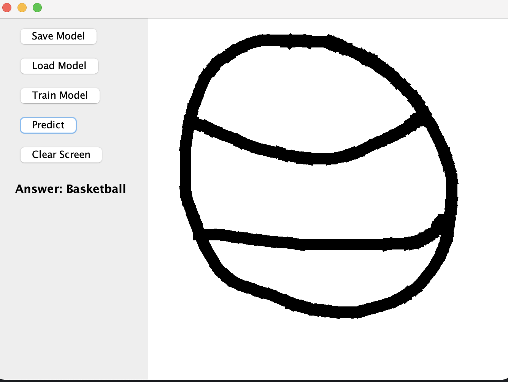

# Doodle Classifier
Author: *Minh Anh Nguyen*  
This application will guess the name of what you are drawing on the canvas.  
Currently available objects: **basketball, door, and snow**  

## How To Use
1. Run the Runner.sh script by executing this command on your terminal.  

```
./Runner.sh
```

2. Click "Load Model"
3. Draw on the canvas
4. Click "Predict" to see the result

### Options
**Train Model:**Train the model based on the dataset in the data folder (size = 10000). You can click it many times to get a better model.
**Save Model:**save the current trained model to my_model.txt
**Load Model:**load the model from my_model.txt
**Predict**: predict what is drawn on the canvas (basketball, door, snow)
**Clear Screen**: clear the canvas

*Example*  

